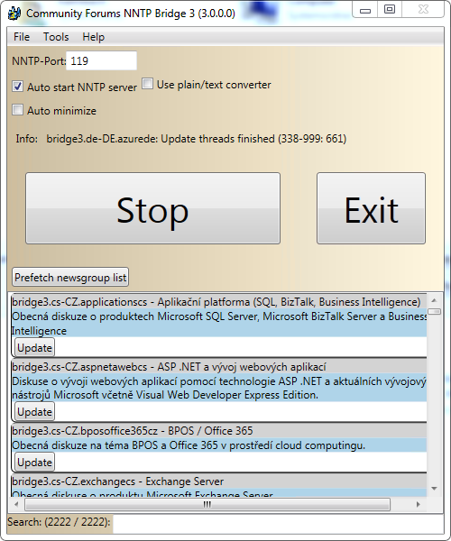
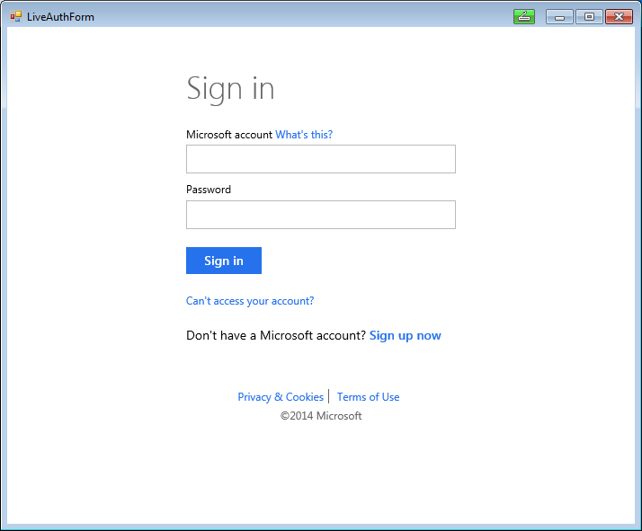
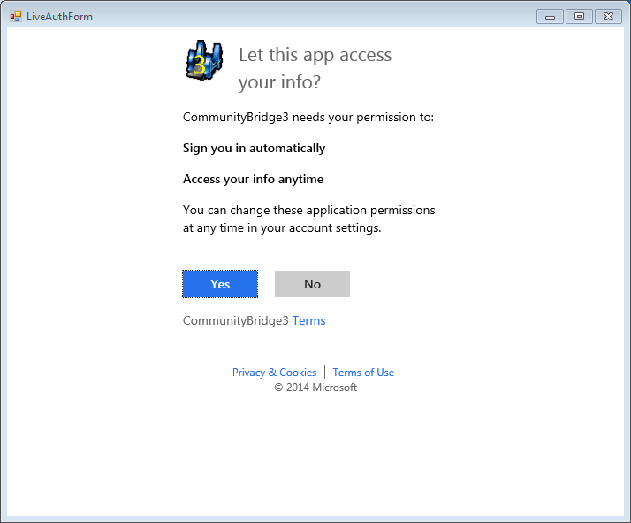
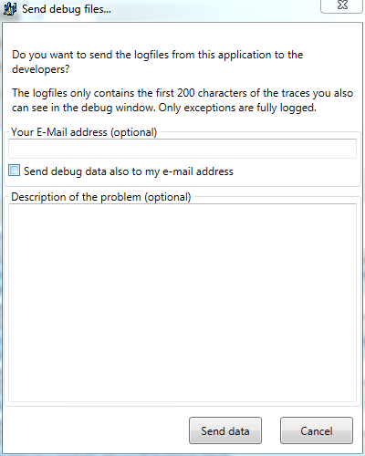

Community project for accessing the MSDN-Forums (https://social.msdn.microsoft.com/Forums/en-US/home) with any NNTP client. It provides an NNTP server (bridge).

# Latest build result

[Download latest Artifacts](https://ci.appveyor.com/project/JochenKalmbach/communitybridge3/build/artifacts)

To use this bridge, you also need to enable the NNTP access on your profile page:

# Go to "Quick access | My Settings | Be sure the "Use NNTP bridge" is checked and press "Save changes"
See also: [http://social.msdn.microsoft.com/Forums/en-US/user](http://social.msdn.microsoft.com/Forums/en-US/user)

This project is the successor of the [https://github.com/JochenKalmbach/communitybridge](https://github.com/JochenKalmbach/communitybridge). It now uses a new REST-based WebService from Microsoft. The old SOAP-WebService will be discontinued. Therefor you need to switch to this version of the bridge.

The new REST web-service only gets informations about the thread and replies, therefor the numbering for the NNTP-server needs to be done inside the bridge. This has some side-effect:
- Accessing a group for the first time might take up to 2-4 minutes, because it must first fetch all data and then create the numbering
- Subsequent access might take several seconds, because the web-service is not that fast...

In the "Info" section of the main window, you can see what the bridge is currently doing.

# Migration from old NNTP bridge

There is no way to migrate from the old NNTP bridge! In order to use the new bridge, you must set-up a new NNTP connection!

# Current limitation
+The web-service currently only returns the public forums! Therefor you currently canot access the private MVP and other private forums...+
Microsoft is working on this, so in several couple of weeks, this should also be available...

## User interface

The main user interface looks like:

After the bridge is started, it tries to login with LiveConnect. Here you also need to give the NNTP-Bridge access to your informations and to allow login (offline-access).

If you want to have better startup performance, you should press "Prefetch newsgrouplist".

Also it is recommended, that you press "Update" on these groups, which you want to subcribe. 
The current web-service is not that fast, so it might take several minutes to refresh a new group. After the first access it might take several seconds, depending on how many traffic is in this group and how long you was visiting the last time.

## Problems!?

If you have problems, please send us the debug files. Therefore you can go to "Help | Send debug files..."!

